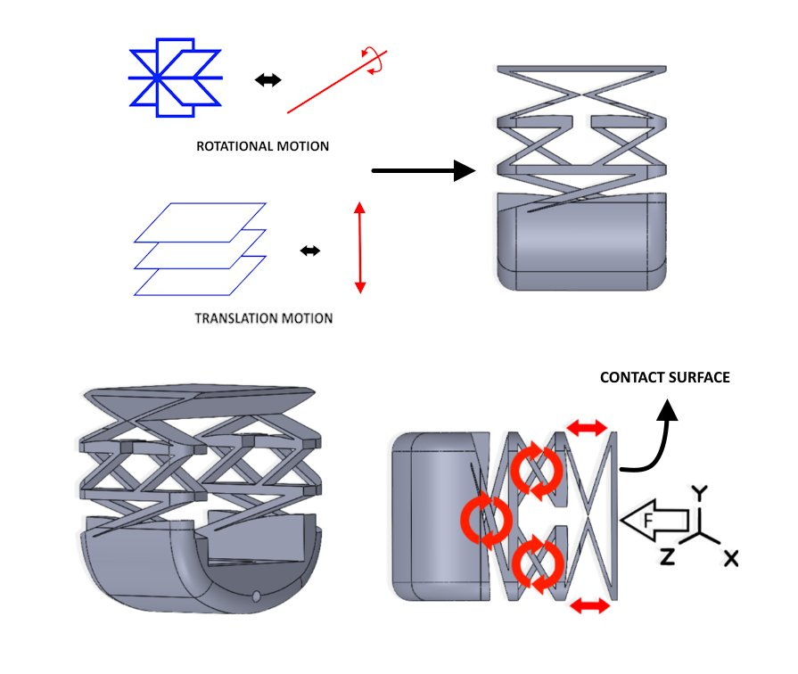
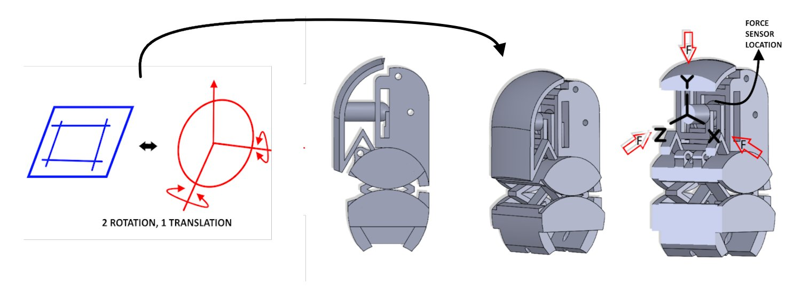
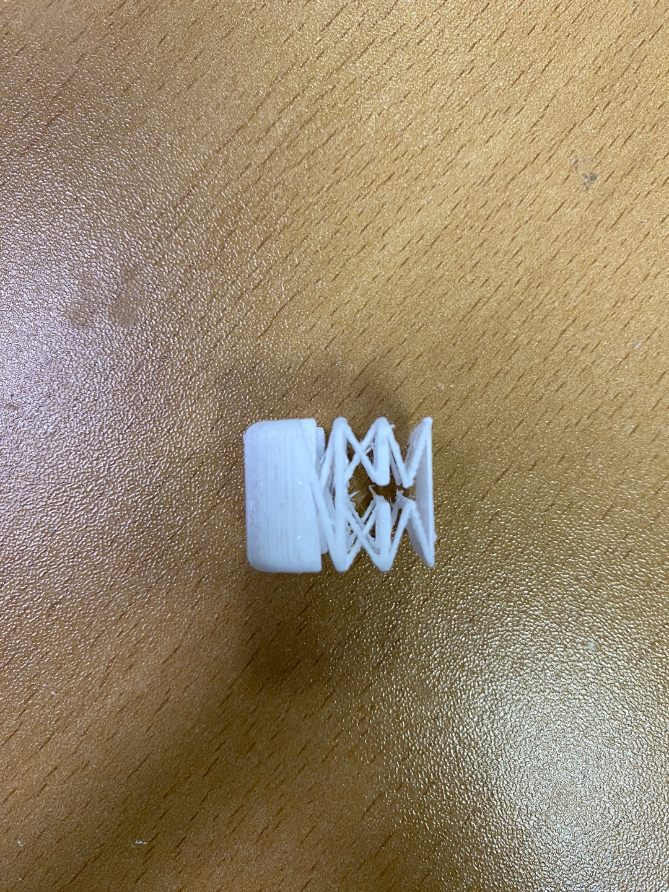
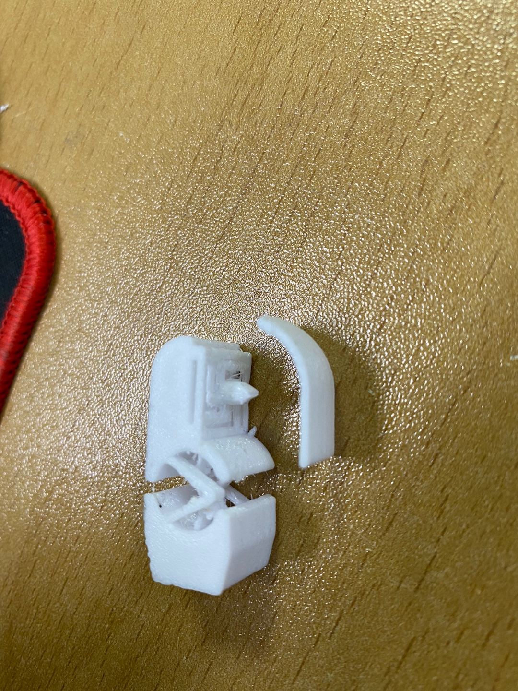
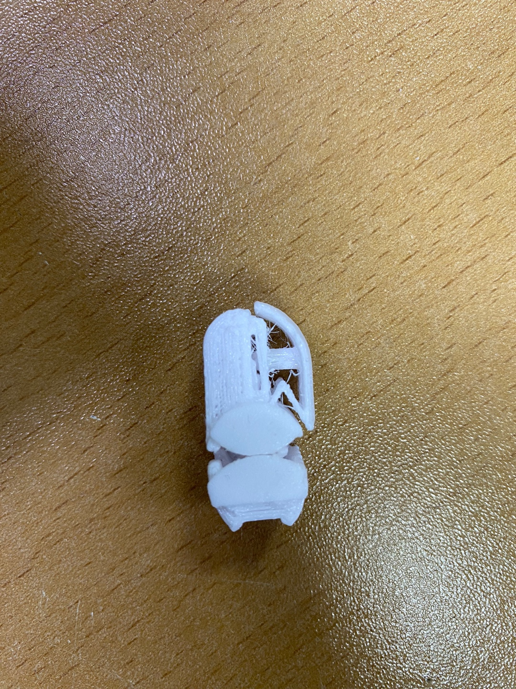

# 🌿 open-huca-skin

**Open source tactile skin with force and shape sensing. Under $10 per finger. In development.**

[](LICENSE)
[]()

---

> *Huca* — "skin" in Muisca, the language of the pre-Columbian Chibcha civilization of the Colombian highlands.

---

## Overview

Open-Huca-Skin is a fully open-source tactile sensing skin designed for direct integration into soft and pseudo-rigid robotic structures. The target is a sensor that anyone can fabricate using a multi-material FDM printer, under $10 per finger, without requiring optical fibers, expensive sensor arrays, or post-processing calibration rigs.

The first proof-of-concept was the skin module integrated into the UMoBIC finger, documented in the thesis and technical report below. The current version under development combines those results with insights from AnySkin, GelSight-class optical tactile sensors, mechanical metamaterial sensing (MetaSense), and fully 3D-printable air-pressure and capacitive proximity approaches into a unified scanning LiDAR-skin architecture.

---

## Prior Work

The mechanical skin module and fingertip force sensor in the UMoBIC finger (open-yta-hand) established the core concept: a compliant monolithic structure that deforms predictably under contact load, encoding force and shape information in its geometry.

- Thesis: *Monolithic Robotics with Cognitive AI* — SKKU 2024 [[full text]](https://dcollection.skku.edu/srch/srchDetail/000000181091?localeParam=en)
- Technical report: *UMoBIC-Finger: A FACT-Based Compliant Revolute Joint for Monolithic Robotic Fingers* [[monolithic-robotics]](https://github.com/yourusername/monolithic-robotics)

<div align="center">
  
  <br><em>UMoBIC skin module — cross-hatch compliant flexure structure enabling rotational and translational contact sensing, with defined contact surface geometry.</em>
</div>

<div align="center">
  
  <br><em>3-DOF sensing architecture: 2 rotation + 1 translation. Force sensor location annotated at contact interface.</em>
</div>

<div align="center">
  
  &nbsp;&nbsp;
  
  <br><em>3D-printed prototypes — compliant flexure element and integrated joint module.</em>
</div>

<div align="center">
  
  <br><em>Assembly prototype — skin module with housing.</em>
</div>

---

## System Architecture — Scanning LiDAR-Skin

The current design is in development. No hardware images are available yet. The following describes the technical architecture.

The goal is to replace high-resolution camera arrays and dense electrode grids with a single-point optical scanner operating inside a sealed compliant chamber — producing high-definition 3D tactile mapping and force estimation from low-cost off-the-shelf components.

### 1. Optical engine

| Component | Description |
|---|---|
| Emitter | 650 nm laser diode |
| Optics | Glass rod lens (cylindrical) — converts point source to razor-thin line for surface scanning |
| Receiver | Optical mouse sensor (PMW3360) — hacked for raw frame capture at >2 kHz with global shutter |

### 2. Resonant scanner

A single-axis compliant flexure mechanism driven by a voice coil salvaged from a speaker or camera OIS module. The flexure is driven at its natural resonant frequency, sweeping the laser line in a continuous oscillating arc. Camera frame capture is synchronized to the zero-crossing of the drive signal, producing time-stamped 1D slices of the membrane surface at each half-cycle.

### 3. Transduction membrane

A flexible silicone or latex membrane placed approximately 10 mm from the scanner. When an external object deforms the membrane, the triangulation geometry of the laser line shifts in the image plane. The in-plane displacement (Δx, Δy) maps directly to surface depth (Z) and local curvature (d²z/dx²).

### 4. Multimodal force sensing

| Channel | Method |
|---|---|
| Global normal force | MEMS barometer (BMP280) — measures internal air pressure change from piston effect of membrane compression |
| Local force distribution | Volumetric deformation analysis — integrates surface displacement map against known elastic modulus of the silicone skin |
| 3-DOF force vector | Cross-hatch compliant flexure structure — encodes 2-axis rotation + 1-axis translation directly in structural deformation |

### Processing pipeline

```
Voice coil drive signal  →  zero-crossing trigger
                                    │
                                    ▼
                     PMW3360 raw frame capture (>2 kHz)
                                    │
                                    ▼
               Laser line center-of-mass extraction (thresholding)
                                    │
                                    ▼
              1D line segments stacked by resonance timestamp
                                    │
                                    ▼
                     2D heightmap reconstruction (3D surface)
                                    │
              ┌─────────────────────┴─────────────────────┐
              ▼                                           ▼
     BMP280 pressure reading                  Surface curvature analysis
              │                                           │
              └─────────────────────┬─────────────────────┘
                                    ▼
                     Force / torque vector + object geometry
```

---

## Design References

This work synthesizes and extends the following:

- **UMoBIC skin module** — compliant monolithic skin integrated into the finger structure (thesis + technical report above)

- **AnySkin** — plug-and-play magnetic tactile skin with cross-instance generalizability for robot learning. DOI: 10.48550/arxiv.2409.08276

- **GelSight** — vision-based optical tactile sensor using elastomer membrane deformation for high-resolution geometry and force estimation. DOI: 10.3390/s17122762

- **MetaSense** — sensing capabilities integrated directly into 3D-printed mechanical metamaterial structures via conductive shear cells and capacitive measurement. DOI: 10.1145/3472749.3474806

- **Fully 3D Printable Robot Hand and Soft Tactile Sensor** — multi-material FDM hand (PETG/TPU/conductive TPU) with air-pressure and capacitive proximity sensing in the fingertip. DOI: 10.1109/ICRA57147.2024.10610731

---

## Roadmap

| Component | Status |
|---|---|
| Proof of concept — UMoBIC skin module | ✅ Done |
| Scanning LiDAR-skin architecture definition | ✅ Done |
| Resonant flexure mechanical design | 🚧 In progress |
| Optical engine prototype | 🚧 In progress |
| Membrane material characterization | 🚧 In progress |
| PMW3360 raw frame capture firmware | ⏳ Planned |
| Resonance sync + frame pipeline | ⏳ Planned |
| 3D surface reconstruction software | ⏳ Planned |
| Force / torque estimation | ⏳ Planned |
| Per-finger integration with open-yta-hand | ⏳ Planned |
| Multi-material FDM fabrication guide | ⏳ Planned |

---

## Related Repositories

| Repository | Description |
|---|---|
| [open-yta-hand](https://github.com/yourusername/open-yta-hand) | UMoBIC finger — first integration platform for skin modules |
| [open-kumanday-humanoid](https://github.com/yourusername/open-kumanday-humanoid) | Target full-body integration platform |

---

## Author

**Gilberto Galvis Giraldo**
M.Sc. Electrical and Computer Engineering — Sungkyunkwan University

---

## License

Apache License 2.0 — see [LICENSE](LICENSE) for details.

